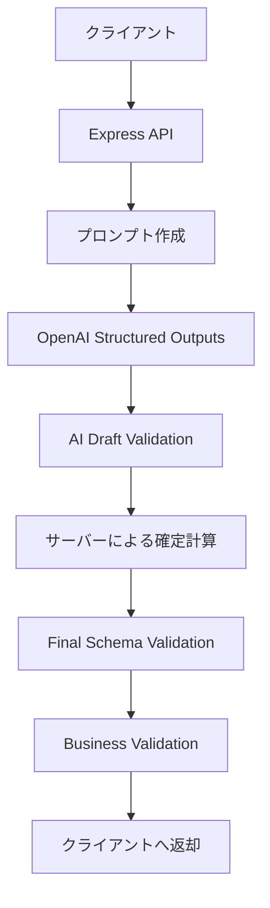

# Family AI Concierge 責務分担設計

## 1. 目的

- AIへ任せる仕事と、プログラムで確定処理する仕事を分離する
- AIの創造性を活かしながら、計算や事実確認の信頼性を確保する
- 機能追加時に処理場所を判断できる基準を作る
- Google Maps、Places、天気などの外部API追加後も設計を崩さない

設計原則は次のとおりである。

**「AIは考える。プログラムは計算・検証する」**

---

## 2. 基本原則

- AIは、候補作成・理由説明・文章生成・プラン構成を担当する
- サーバーは、計算・検証・整形・秘密情報管理を担当する
- 外部APIは、現在の事実や正確な数値を提供する
- クライアントは、入力・表示・ユーザー操作を担当する
- AIが生成した値を、検証せずに事実として表示しない
- 正確に計算できる処理をAIへ任せない
- 外部APIで確認可能な情報をAIの知識だけで断定しない

---

## 3. AIが担当すること

- 家族プロフィールを踏まえたプラン案の作成
- 3つの異なるプランの企画
- プランタイトル
- おすすめ理由
- 家族全員の満足度を考えた体験構成
- スポットや食事の組み合わせ
- タイムラインの下書き
- メンバーごとの楽しみ方や注意点の説明
- 自由文の要約や説明

**重要:** AIの出力は「候補または下書き」であり、最終確定データではない。  
最終的にユーザーへ返す値は、サーバー側の計算・検証を通過したものだけとする。

---

## 4. サーバーが担当すること

- APIキーなどの秘密情報管理
- OpenAI APIおよび外部APIの呼び出し
- Structured OutputsのSchema管理
- Schema Validation
- Business Validation
- 往復移動時間の計算
- 現地で楽しめる時間の計算
- 予算判定
- 帰着時刻判定
- 外部API結果とAI出力の統合
- エラー処理
- ユーザーへ返す最終Responseの確定

---

## 5. クライアントが担当すること

- 家族プロフィールの入力・編集
- 今日の参加者選択
- おでかけ条件の入力
- ローディング表示
- プラン表示
- エラー表示
- 再試行や条件変更の操作

クライアント側にはAPIキーを置かない。  
重要なValidationや確定計算もクライアントには置かない。  
表示前の信頼境界はサーバー側に置く。

---

## 6. 外部APIが担当すること

将来追加する情報源の例:

| 情報源 | 担当する情報 |
|---|---|
| Google Maps / Routes | 現実の移動時間・距離 |
| Google Places | 施設名、住所、営業時間、評価、口コミ、料金情報 |
| 天気API | 天候、気温、降水確率 |
| イベント情報API | 開催日、時間、対象年齢 |
| 駐車場・交通情報API | 駐車場、混雑、渋滞 |

外部APIの情報は、取得時刻や情報源を意識して扱う。  
確認できない情報を事実として断定しない。

---

## 7. 現在の処理フロー

```text
クライアント
  ↓
Express API
  ↓
プロンプト作成
  ↓
OpenAI Structured Outputs
  ↓
AI Draft Validation
  ↓
サーバーによる確定計算
  ↓
Final Schema Validation
  ↓
Business Validation
  ↓
クライアントへ返却
```



---

## 8. 判断例

| 処理 | 担当 | 理由 |
|---|---|---|
| プラン名を考える | AI | 創造的な処理 |
| おすすめ理由を書く | AI | 家族情報を踏まえた文章生成 |
| 往復移動時間を足す | サーバー | 確定的な計算 |
| 予算内か判定する | サーバー | 数値に基づく判定 |
| 実際の移動時間を取得する | 外部API | 最新かつ現実の情報が必要 |
| 営業時間を取得する | 外部API | AIの記憶で断定できない |
| 結果をカード表示する | クライアント | UIの責務 |

---

## 9. 禁止事項

- AIに正確な数値計算を依存しない
- AIが生成した営業時間や料金を未確認の事実として扱わない
- APIキーをクライアントへ置かない
- Validationをクライアントだけに任せない
- 外部APIの生データを無加工でAIへ大量投入しない
- AIの出力を検証せずそのままユーザーへ返さない

---

## 10. 今後の実装判断

新しい処理を追加するときは、次の順に判断する。

1. **正確な計算か** → サーバー
2. **最新の事実が必要か** → 外部API
3. **候補作成・比較・説明などの推論か** → AI
4. **入力・表示・操作か** → クライアント
5. **複数の責務を持つ場合** → 処理を分割する

---

## 11. 現時点の具体例

### AIが返す下書き（Draft）

- `id`
- `title`
- `reason`
- `cost`
- `spots`
- `withinBudget`
- `timeline`

### サーバーが確定する処理

- `roundTripTime` を timeline から計算
- `localEnjoymentTime` を timeline から計算
- Schema Validation
- Business Validation

### 注記

`cost` と `withinBudget` は現在AIが生成している。  
将来、料金情報を外部API等で取得できるようになった段階で、サーバー側の確定処理へ移す候補である。

---

## 関連ドキュメント

- `docs/FAMILY_AI_CONCIERGE_CHARTER.md` … プロダクト憲章
- `docs/AI_DEVELOPMENT_PLAYBOOK.md` … 全AIアプリ共通の開発ルール
