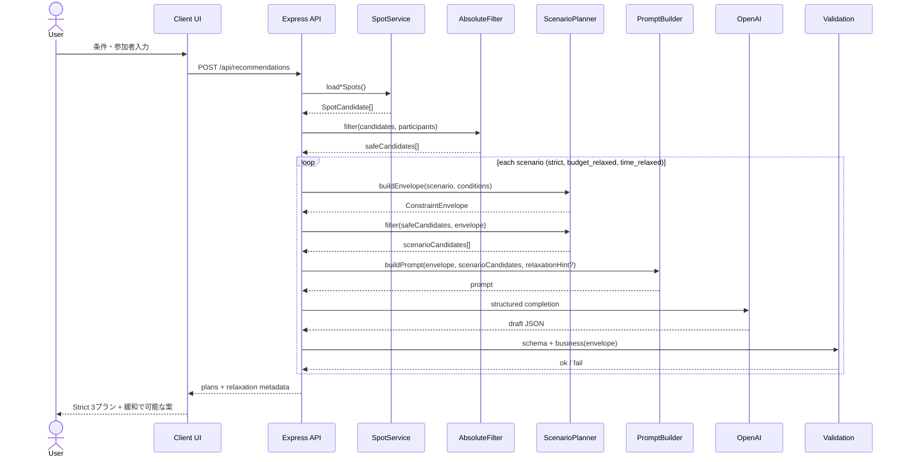

# Constraint Relaxation 設計案

Family AI Concierge における「条件を少し変えたら実現できるプラン」の基本設計。

**ステータス:** 設計のみ（未実装）  
**関連:** `FAMILY_AI_CONCIERGE_CHARTER.md` / `AI_DEVELOPMENT_PLAYBOOK.md` / `AI_SERVER_RESPONSIBILITY.md`

---

## 1. Constraint Relaxation 設計案（①）

### 1.1 コンセプト

Family AI Concierge は、ユーザー入力条件を満たすプランだけでなく、**ユーザーが自発的に緩和を選べば実現できる代替案**も示す。

- **Strict（厳守）:** ユーザーが入力した条件をそのまま適用する（現行MVPの基準）
- **Relaxed（緩和）:** あらかじめ定義したシナリオで、**明示的に許可された範囲だけ**条件を広げる

緩和は AI の恣意ではなく、**サーバーが定義したシナリオ envelope** の中だけで行う。  
ユーザーは UI 上で「少し予算を増やす」「少し早起きする」など、**何を緩めたか**を理解したうえで採用する。

### 1.2 設計原則

| 原則 | 内容 |
|---|---|
| 絶対条件は緩めない | 安全・アレルギー・cannotTolerate・参加者範囲は全シナリオ共通 |
| 緩和は明示する | 各プランに「何をどれだけ緩めたか」を必ず表示 |
| 計算はサーバー | 予算・時刻・移動時間の判定は GPT に任せない |
| AI は構成と説明 | 候補の組み合わせ・理由・タイムライン下書きは GPT |
| SpotCandidate 正規化 | 外部データは Mapper 経由で共通型にしてから Filter へ |
| 検証はシナリオ単位 | Validation / Business Validation は **適用中の envelope** に対して実行 |

### 1.3 用語

| 用語 | 意味 |
|---|---|
| **ConstraintEnvelope** | 1シナリオで有効な条件の集合（budget上限、start/end、移動許容など） |
| **AbsoluteFilter** | 絶対条件に基づき候補スポットを除外 |
| **ScenarioFilter** | シナリオ envelope に基づき候補を絞り込み（距離・予算目安・件数など） |
| **RelaxationHint** | UI / reason 用。「予算+2,000円」「出発30分早く」など人が読める説明 |

### 1.4 現行3プランとの関係

現行の「体験重視 / 余裕重視 / 安心柔軟」は **プランの体験軸**。  
Constraint Relaxation は **条件の厳しさ軸** であり、直交する。

**MVP方針（推奨）:**

1. まず **Strict envelope** で現行どおり3プランを生成
2. Strict で成立しにくい場合、またはユーザー操作で、**緩和シナリオ別の代替案**を追加提示
3. 緩和案は「別プラン」として並べ、採用時に envelope をユーザーが承認

将来は「Strict 3本 + BudgetRelaxed 1本」のようなハイブリッドも可能だが、MVPでは **シナリオ切替は段階導入** とする。

---

## 2. シナリオ一覧（②）

### 2.1 MVP採用シナリオ（推奨）

| ID | 表示名 | 目的 | MVP |
|---|---|---|---|
| `strict` | 厳守 | 入力条件どおり | **採用（基準）** |
| `budget_relaxed` | 予算ゆとり | 費用で諦めていた候補を解放 | **採用** |
| `time_relaxed` | 時間ゆとり | 早出・遅帰で移動・滞在を確保 | **採用** |

**結論:** MVP では **Strict + BudgetRelaxed + TimeRelaxed の3つで十分**。  
体験の多様性は現行3プラン軸で担保し、緩和軸はまずこの3つに限定する。

### 2.2 MVP次点（Phase 1.5 候補）

| ID | 表示名 | 目的 | 採用判断 |
|---|---|---|---|
| `meal_flexible` | 食事ゆとり | 昼食持参・軽食で予算・時間を確保 | 入力が簡単なら早めに追加価値大 |
| `lighter_itinerary` | ゆったり行程 | スポット数削減・移動回数削減 | 現行プラン2と重複しやすい。文言統合で対応可 |
| `mobility_relaxed` | 移動ゆとり | canTolerate 上限をシナリオ内で拡張 | 外部ルートAPI未接続時は効果限定 |

### 2.3 採用しない（MVP Non Goals）

- 複合緩和（予算+時間を同時に広げる）— 説明負荷が高い
- AI による動的緩和幅 — 再現性・検証困難
- 絶対条件の緩和（アレルギー無視など）— Charter 違反

---

## 3. 緩和可能条件一覧（③）

| 条件 | 緩和の意味 | 対応シナリオ | サーバー計算 | GPT |
|---|---|---|---|---|
| 予算 | 上限を広げる | `budget_relaxed` | envelope.budgetMax を再計算 | 概算 cost の説明 |
| 出発時刻 | 早く出発 | `time_relaxed` | envelope.startTime を前倒し | タイムライン調整 |
| 帰宅時刻 | 遅く帰宅 | `time_relaxed` | envelope.endTime を延長 | タイムライン調整 |
| 移動時間許容 | 往復の許容上限拡張 | `mobility_relaxed`（将来） | canTolerate 解析 + Routes API | 移動は概算表現 |
| スポット数 | 多め / 少なめ | `lighter_itinerary` | 候補件数上限変更 | 構成 |
| 昼食方法 | 持参・軽食・外食 | `meal_flexible` | 予算・時間 envelope へ反映 | meal ノード設計 |
| 待ち時間許容 | 混雑時間帯の許容 | 将来（Crowd連携） | シグナルで filter 緩和 | 時間帯提案 |
| 雨天リスク | 屋内寄りの許容コスト | 将来（Weather連携） | category 重み変更 | 屋内構成 |

**緩和時に必ず付与するメタデータ:**

```ts
type RelaxationHint = {
  scenarioId: string;
  label: string;           // 「予算を約2,000円増やす」
  changedFields: string[]; // ['budget', 'endTime']
  before: Record<string, string>;
  after: Record<string, string>;
};
```

---

## 4. 絶対条件一覧（④）

Charter・現行 Prompt の制約優先順位に整合させる。

| 分類 | 条件 | 根拠 | 緩和 |
|---|---|---|---|
| 安全・健康 | 安全性を損なう施設・行動 | Charter §6-5 | **不可** |
| 安全・健康 | アレルギー（設定時） | Charter §6-5, §7 | **不可** |
| 安全・健康 | 苦手な食べ物（設定時） | Charter §7 | **不可** |
| 体力・耐性 | cannotTolerate（設定時） | Prompt 制約優先3位 | **不可** |
| 参加者 | 選択参加者のみを対象 | Charter §6-4 | **不可** |
| 年齢 | 年齢不適合な体験 | Charter §7 | **不可** |
| 事実性 | 未確認情報の断定 | Charter §6-8 | **不可** |
| データ品質 | 検証失敗データの UI 伝播 | Playbook / Charter §9 | **不可** |
| 契約 | JSON Schema 準拠 | Charter §7 | **不可** |

**補足（設計上の解釈）:**

- **帰宅時刻・予算** は Charter 上「必ず守る」プロダクトルールだが、これは **ユーザーが入力した envelope に対する話**。  
  `time_relaxed` / `budget_relaxed` は **ユーザーが追加で承認する別 envelope** として扱い、Charter と矛盾しない。
- **canTolerate** は緩和可能候補だが、MVP では未実装。将来 `mobility_relaxed` で **拡張のみ**（縮小はしない）。

---

## 5. シナリオ別 緩和幅（③ 詳細）

### `strict`

| 項目 | 値 |
|---|---|
| budgetMax | 入力 budget |
| startTime | 入力 startTime |
| endTime | 入力 endTime |
| maxSpots | 3（AIプラン内の主要スポット目安） |
| mealMode | 入力・プロフィールに従う |

### `budget_relaxed`

| 項目 | 緩和幅（推奨） |
|---|---|
| budgetMax | `max(入力 × 1.10, 入力 + 2,000円)` を上限とし、**大きい方**を採用 |
| その他 | strict と同じ |

**例:** 予算 10,000円 → 12,000円（+20% だが cap なしの場合は要検討。MVPは上記式で十分）

**UI文言例:** 「予算を約2,000円（または10%）増やすと実現できるプラン」

### `time_relaxed`

| 項目 | 緩和幅（推奨） |
|---|---|
| startTime | **30分早い**（入力より前にずらせる下限: 06:00） |
| endTime | **30分遅い**（入力より後にずらせる上限: 22:00） |
| その他 | strict と同じ |

**UI文言例:** 「出発を30分早め、帰宅を30分遅くすると実現できるプラン」

### `meal_flexible`（Phase 1.5）

| 項目 | 緩和幅 |
|---|---|
| mealMode | `bring_lunch` を許可 |
| budgetMax | 外食1回分を概算減算（例: 1,500〜2,500円/家族規模は将来計算） |

---

## 6. Retrieval と Generation の責務分離（④）

### 6.1 ルールベース（サーバー / プログラム）

| 処理 | 内容 |
|---|---|
| データ取得 | SpotService → SpotCandidate[] |
| AbsoluteFilter | 年齢・cannotTolerate・アレルギー関連の除外（タグ/カテゴリ/将来メタデータ） |
| Envelope 生成 | シナリオごとの ConstraintEnvelope 計算 |
| ScenarioFilter | 予算目安・距離（将来）・カテゴリ・件数上限 |
| 候補整形 | Prompt 用テキスト化（AI は CSV/GeoJSON を見ない） |
| 時間集計 | roundTripTime / localEnjoymentTime（現行 enrich） |
| 予算判定 | cost 概算 vs envelope.budgetMax → withinBudget |
| 帰宅判定 | timeline return vs envelope.endTime |
| Schema / Business Validation | シナリオ envelope 基準で検証 |
| RelaxationHint 生成 | 緩和内容の構造化 |

### 6.2 GPT（AI）

| 処理 | 内容 |
|---|---|
| プラン企画 | 3体験軸（体験 / 余裕 / 安心）の構成 |
| タイトル・理由 | 家族文脈・緩和のトレードオフ説明 |
| タイムライン下書き | departure / spot / meal / return |
| 候補の選択 | 渡された SpotCandidate[] から優先利用 |
| 不確実性の表現 | 未確認の料金・営業時間は断定しない |

### 6.3 境界の判断基準

```
正確に計算できる → サーバー
創造・説明・構成 → GPT
外部APIで取得した事実 → サーバーが整形して GPT へ文脈として渡す
```

**GPT に渡さないもの:** 生 CSV、緩和幅の数値計算、withinBudget の最終 boolean、return 時刻適合の最終判定。

---

## 7. 将来構造案（⑤）

```text
[Client]
  OutingConditions + Participants + optional enrichments
    ↓
[Server: SpotService]
  SpotCandidate[]  (sample | kariya | nagakute | osm | places)
    ↓
[AbsoluteFilter]          ← 絶対条件（全シナリオ共通）
  SpotCandidate[]
    ↓
[ScenarioPlanner]         ← strict / budget_relaxed / time_relaxed
  ├─ ConstraintEnvelope (per scenario)
  └─ ScenarioFilter (per scenario)
    ↓
  Map<ScenarioId, SpotCandidate[]>
    ↓
[PromptBuilder]           ← envelope + candidates + relaxation hints
    ↓
[GPT]                     ← シナリオ×体験軸ごとに draft
    ↓
[Enrich + Validation]     ← envelope 基準で確定
    ↓
[Response + RelaxationHint]
    ↓
[UI]                      ← Strict 結果 + 「緩和すると可能」カード
```

### 推奨モジュール（将来）

| モジュール | 責務 |
|---|---|
| `constraints/absoluteFilter.ts` | 絶対条件フィルタ |
| `constraints/scenarioProfiles.ts` | シナリオ定義と envelope 生成 |
| `constraints/scenarioFilter.ts` | シナリオ別候補絞り込み |
| `mappers/*` | データソース → SpotCandidate |
| `services/SpotService.ts` | 取得の統合口 |
| `validation/*` | 既存 Schema + envelope 付き Business Validation |

---

## 8. シーケンス図（⑤）



---

## 9. 将来拡張時の影響範囲（⑥）

| 追加要素 | 主な変更箇所 | 変更不要（設計上） |
|---|---|---|
| **History** | PromptBuilder（文脈追加）、ScenarioFilter（好み重み） | SpotCandidate 型、AbsoluteFilter |
| **Weather** | Enrichment 入力、ScenarioFilter（屋内重み） | Mapper、Relaxation シナリオ定義 |
| **Crowd** | Enrichment、ScenarioFilter（時間帯） | GPT Schema、UI ルーティング |
| **Season** | ScenarioFilter（季節タグ）、Prompt 考慮事項 | AbsoluteFilter |
| **新データソース** | Mapper + SpotService | Prompt / Validation 契約 |
| **新シナリオ** | scenarioProfiles.ts のみ | AbsoluteFilter、SpotCandidate |
| **Routes API** | ScenarioFilter（距離）、Enrich（移動時間） | Relaxation の考え方 |

**設計が最小変更で済む理由:**

1. すべての外部情報は **Enrichment / Filter のプラグイン** として差し込む
2. AI への入力は常に **SpotCandidate[] + ConstraintEnvelope**
3. 緩和は **シナリオ定義の追加** で表現し、Prompt の根本構造は維持
4. 検証は **envelope を引数に取る** 形に拡張するだけ

---

## 10. カテゴリ分布に関する所見（参考）

現行 Kariya データは `other` が多い。Constraint Relaxation 実装時は **category が粗くても AbsoluteFilter / ScenarioFilter は動作** するが、予算・時間緩和の効果説明には **category の改善** が別途有効。  
→ Mapper 改善は Relaxation とは独立したデータ品質タスクとして継続。

---

## 11. MVP 実装順（参考・今回は未着手）

1. `ConstraintEnvelope` 型と `scenarioProfiles` 定義
2. Strict のみ envelope 検証を Business Validation に接続
3. `budget_relaxed` / `time_relaxed` の envelope 生成と UI 提示
4. GPT prompt へ `RelaxationHint` 注入
5. Phase 1.5: `meal_flexible`
